# External Network VA Scanner

External Network VA Scanner (Garuda) is a web-based, non-destructive assessment platform for public IPv4 assets that you own or have explicit written authorization to test. It validates engagement scope, runs controlled scanner adapters, normalizes evidence, stores history, compares scans, and exports reports.

> Only scan systems that you own or have explicit written authorization to assess. Unauthorized scanning may be illegal and may disrupt third-party services.

## Version 1 features

- FastAPI backend, Streamlit dashboard, JWT login, Argon2 password hashing, and admin/analyst/viewer roles.
- Engagement authorization records with dates, approved CIDRs, exclusions, contacts, and scan windows.
- Public IPv4-only validation, `/24` default CIDR ceiling, deduplication, rate/timeout controls, audit logging, and scan cancellation.
- Safe adapters for Nmap, Naabu, ProjectDiscovery httpx/Nuclei, testssl.sh, ssh-audit, dnsx, and GoWitness.
- Nmap XML, Naabu/httpx/Nuclei JSONL, testssl JSON, ssh-audit JSON, and dnsx JSON parsers.
- SQLite persistence using PostgreSQL-compatible SQLAlchemy models.
- Stable finding fingerprints, cross-scanner deduplication, contextual priorities, scan comparison, and HTML/CSV/JSON/JSONL/PDF reports.
- Optional scanners do not prevent startup. Nmap is required to execute a scan because all discovery must be confirmed by Nmap.

## Architecture

```mermaid
flowchart LR
  U["Authorized analyst"] --> S["Streamlit dashboard"]
  S --> A["FastAPI + RBAC"]
  A --> V["Scope and authorization validator"]
  V --> O["Cancellable scan orchestrator"]
  O --> T["Allowlisted scanner adapters"]
  T --> P["Output parsers"]
  P --> N["Normalize, deduplicate, risk-score"]
  N --> D[("SQLite / PostgreSQL")]
  D --> R["Reports and comparison"]
```



Scanner arguments are assembled exclusively inside adapters and executed with `asyncio.create_subprocess_exec`; `shell=True` and browser-supplied command flags are never used.

## Quick start

### One-click Docker launchers (recommended)

Windows: double-click `start-docker-windows.bat`, or run:

```bat
start-docker-windows.bat
```

Linux, Kali, Ubuntu, or WSL:

```bash
chmod +x start-docker-linux.sh
./start-docker-linux.sh
```

The Docker launchers verify Docker, create `.env` with a cryptographically random secret when needed, build the self-contained images, start both healthy services, and open the dashboard. The approved scanner suite, browser, and signed template snapshot are included in the image; end users do not install scanner binaries or templates manually. The first build is larger because it creates the complete scanner appliance. Set `GARUDA_NO_BROWSER=1` to suppress browser launch.

### One-command launchers

Windows PowerShell:

```powershell
powershell -ExecutionPolicy Bypass -File .\scripts\start_windows.ps1
```

Linux, Kali, Ubuntu, or WSL:

```bash
chmod +x scripts/start_linux.sh
./scripts/start_linux.sh
```

Both scripts create `.venv` and `.env` when needed, generate a random application secret, apply database migrations, start the API and dashboard in the background, write logs/PID files under `logs/`, and open the dashboard. Set `NO_BROWSER=1` on Linux or use `-NoBrowser` on Windows to suppress browser launch.

### Manual launch

```bash
python3 -m venv .venv
source .venv/bin/activate
pip install -e '.[dev]'
cp .env.example .env
python -c 'from app.database import initialize_database; initialize_database()'
uvicorn app.main:app --reload
```

In another terminal:

```bash
source .venv/bin/activate
streamlit run dashboard/streamlit_app.py
```

Open the API at `http://127.0.0.1:8000`, API documentation at `http://127.0.0.1:8000/docs`, and dashboard at `http://127.0.0.1:8501`. Use **Initial setup** once to create the first administrator.

## Scan profiles

- **Quick:** top 100 TCP ports, service detection, no vulnerability templates.
- **Standard:** top 1,000 TCP ports, service/HTTP checks, safe Nuclei policy, and optional TLS/SSH checks.
- **Full:** all TCP ports and reviewed checks; expect significantly longer execution.
- **Custom:** controlled switches only. Arbitrary tool arguments are intentionally unsupported.

Configuration lives in `config/scan_profiles.yaml`, `config/nmap_scripts.yaml`, `config/nuclei_policy.yaml`, and `config/risk_scoring.yaml`. Review these policies before each production engagement.

## Bundled scanner coverage

The Docker image pins and checksum-verifies the scanner downloads during its build:

| Layer | Bundled component | Purpose |
| --- | --- | --- |
| Discovery | Nmap 7.95, Naabu 2.6.1 | Confirm hosts, ports, services, and versions |
| Web | ProjectDiscovery httpx 1.9.0 | Validate HTTP(S), titles, servers, TLS, and technologies |
| Vulnerabilities | Nuclei 3.11.0 + templates 10.4.7 | Run signed, allowlisted CVE, exposure, misconfiguration, SSL, and network checks |
| Protocol | testssl.sh 3.2.4, ssh-audit 3.9.0, dnsx release 1.3.0 | Review TLS, SSH, and DNS evidence |
| Visual evidence | GoWitness 3.1.1 + Chromium | Capture optional screenshots of Nmap-confirmed web endpoints |

Nuclei excludes `dos`, `brute-force`, `fuzz`, `intrusive`, `exploit`, `headless`, and `code` tags. SSH rate testing is disabled. Arbitrary user-supplied scanner arguments are never accepted. Each scan records tool coverage, failures, evidence counts, and bundled versions so an empty finding list is not presented as proof of security.

## Testing

```bash
pytest
ruff check app dashboard tests
```

Tests use fixtures and mocks only; they do not scan external systems.

## Docker

```bash
./start-docker-linux.sh
```

On Windows, double-click `start-docker-windows.bat`. The image includes the complete approved scanner suite listed above. See [INSTALL.md](INSTALL.md), [AUTHORIZED_USE.md](AUTHORIZED_USE.md), [SECURITY.md](SECURITY.md), and [THIRD_PARTY_NOTICES.md](THIRD_PARTY_NOTICES.md).

## Screenshots

Dashboard, engagement, scan progress, asset, finding, comparison, and report screenshots will be added after the first tagged UI release.

## Limitations

This is not an exploit framework or proof that an asset is secure. Version-derived CVEs require confidence labeling and manual validation. External observations can be affected by firewalls, CDNs, load balancers, rate limits, and scan windows. CISA KEV/CVE online feed synchronization and Greenbone are Version 2 integration points.

Contributions must preserve the prohibited-functionality policy; see [CONTRIBUTING.md](CONTRIBUTING.md).

